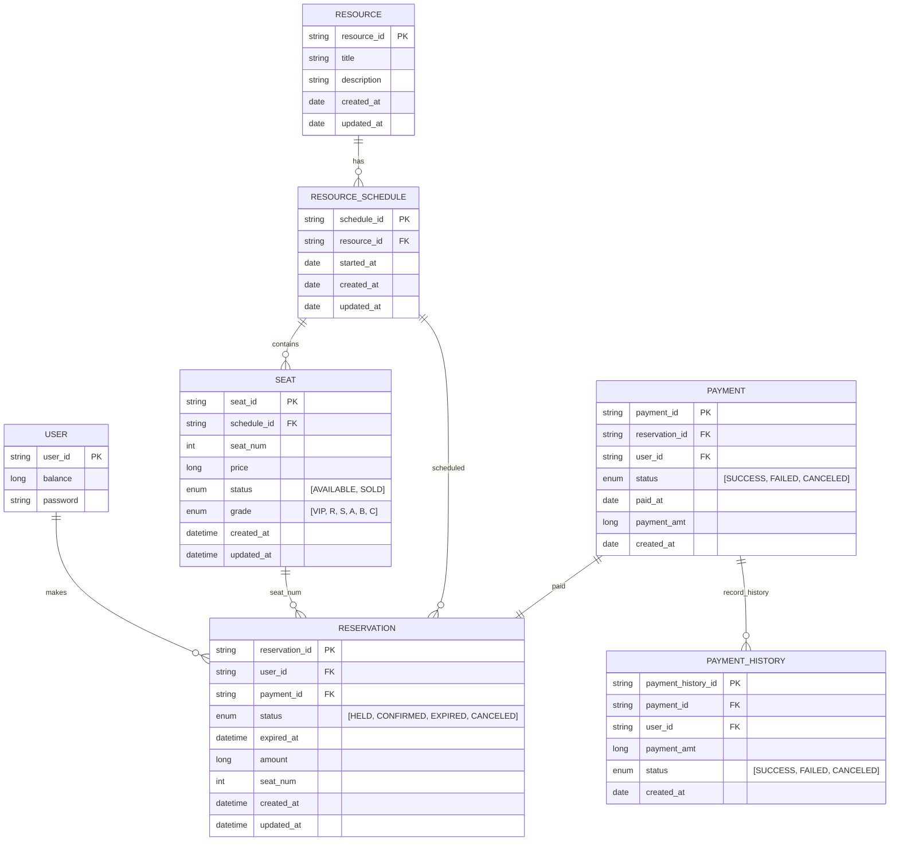

# 콘서트 예약 서비스

----
# ERD

----
# 엔티티
## 공연 관련 엔티티
### RESOURCE
| 필드              | 타입     | 설명    |
|-----------------|--------|-------|
| resource_id(PK) | string | 공연id  |
| title           | string | 공연 제목 |
| description     | string | 공연 설명 |
| created_at      | date   | 생성일자  |
| updated_at      | date   | 수정일자  |

### RESOURCE_SCHEDULE 
| 필드              | 타입     | 설명        |
|-----------------|--------|-----------|
| schedule_id(PK) | string | 공연 스케줄 id |
| resource_id(FK) | string | 공연id      |
| started_at      | date   | 공연 시작 일자  |
| created_at      | date   | 생성일자      |
| updated_at      | date   | 수정일자      |

### SEAT
| 필드              | 타입       | 설명                     |
|-----------------|----------|------------------------|
| seat_id(PK)     | string   | 좌석id                   |
| schedule_id(FK) | string   | 공연 스케줄 id              |
| seat_num        | int      | 좌석 번호                  |
| price           | long     | 좌석 가격                  |
| status          | enum     | "[AVAILABLE, SOLD]"    |
| grade           | enum     | "[VIP, R, S, A, B, C]" |
| created_at      | datetime | 생성일자                   |
| updated_at      | datetime | 수정일자                   |

## 고객관련 엔티티
### USER
| 필드          | 타입     | 설명      |
|-------------|--------|---------|
| user_id(PK) | string | 고객id    |
| balance     | long   | 고객 잔액   |
| password    | string | 고객 비밀번호 |
## 예약관련 엔티티
### Reservation
| 필드                 | 타입       | 설명                                     |
|--------------------|----------|----------------------------------------|
| reservation_id(PK) | string   | 예약id                                   |
| user_id(FK)        | string   | 고객id                                   |
| payment_id(FK)     | string   | 결제id                                   |
| status             | enum     | "[HELD, CONFIRMED, EXPIRED, CANCELED]" |
| expired_at         | datetime | 만료 시간                                  |
| amount             | long     | 가격                                     |
| seat_num           | int      | 좌석 번호                                  |
| created_at         | datetime | 생성일자                                   |
| updated_at         | datetime | 수정일자                                   |
## 결제 관련 엔티티
### PAYMENT
| 필드                 | 타입     | 설명                            |
|--------------------|--------|-------------------------------|
| payment_id(PK)     | string | 결제 id                         |
| reservation_id(FK) | string | 예약 id                         |
| user_id(FK)        | string | 고객 id                         |
| status             | enum   | "[SUCCESS, FAILED, CANCELED]" |
| paid_at            | date   | 결제시간                          |
| payment_amt        | long   | 결제액                           |
| created_at         | date   | 생성일자                          |

### PAYMENT_HISTORY
| 필드                     | 타입     | 설명                            |
|------------------------|--------|-------------------------------|
| payment_history_id(PK) | string | 결제이력id                        |
| payment_id FK          | string | 결제id                          |
| user_id FK             | string | 고객id                          |
| payment_amt            | long   | 결제액                           |
| status                 | enum   | "[SUCCESS, FAILED, CANCELED]" |
| created_at             | date   | 생성일자                          |