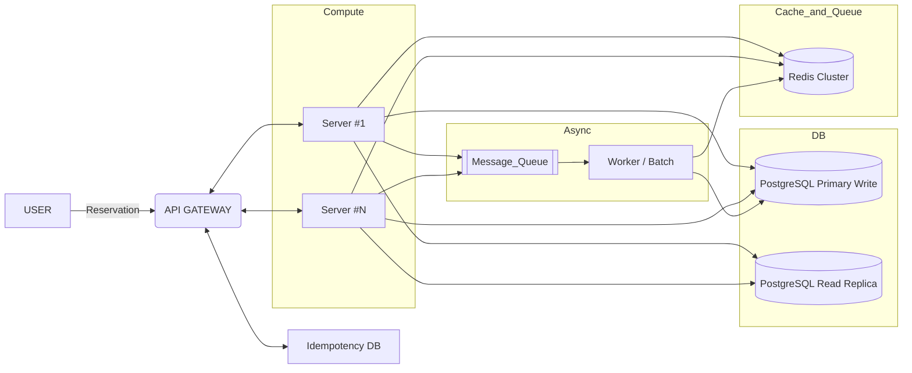

# 인프라 구성도

## 1. 전체 아키텍처 개요

본 시스템은 **대규모 트래픽이 발생하는 콘서트 예약 서비스**를 대상으로 설계되었다.  
동시 접속, 좌석 선점 경쟁, 중복 결제, 대기열 처리 등의 문제를 안정적으로 처리하기 위해  
**API Gateway 중심 구조 + 무상태 서버 + Redis 기반 동시성 제어 + 비동기 처리 구조**를 채택하였다.

---

## 2. 구성 요소별 역할

### 2.1 User

- 웹 / 모바일 클라이언트
- 예약 조회, 좌석 선택, 결제 요청 수행
- 모든 요청은 API Gateway를 통해서만 접근

---

### 2.2 API Gateway

- 외부 요청의 단일 진입점 (Single Entry Point)
- JWT 인증 및 인가 처리
- 대기열(Queue) 토큰 검증
- Rate Limit / Throttling 적용
- 내부 App Server로 라우팅
- **Idempotency-Key 기반 중복 요청 차단**

---

### 2.3 Compute Layer (App Servers)

- 무상태(Stateless) 애플리케이션 서버
- 예약 가능 날짜 / 좌석 조회
- 좌석 HOLD 및 예약 생성
- 결제 요청 처리
- Redis, DB, Message Queue와 연동
- Auto Scaling을 통한 수평 확장 가능

---

### 2.4 Idempotency DB

- 결제 API의 중복 호출 방지를 위한 전용 저장소
- `Idempotency-Key` 기준으로 요청 상태 관리
- 동일 요청 재호출 시 이전 처리 결과 반환
- 결제의 **Exactly-Once 처리 보장**

---

### 2.5 Database Layer (PostgreSQL)

#### Primary (Write DB)
- 예약 생성 및 상태 변경
- 결제 확정 처리
- 좌석 상태 업데이트

#### Read Replica
- 예약 가능 날짜 조회
- 좌석 조회 등 조회성 API 처리
- Primary DB 부하 분산

---

### 2.6 Cache & Queue (Redis Cluster)

Redis는 본 시스템에서 **핵심 인프라 컴포넌트**로 활용된다.

- **Cache**
    - 공연 정보
    - 예약 가능 날짜
    - 좌석 맵 정보

- **Lock**
    - 좌석 선점을 위한 분산 락 (SETNX + TTL)
    - 동시 예약 충돌 방지

- **Queue**
    - 대기열 토큰 발급 및 관리
    - 사용자 순번 및 만료 시간 관리

---

### 2.7 Async Processing (Message Queue & Worker)

#### Message Queue
- 예약 생성 이벤트
- 결제 완료 이벤트
- 비동기 작업 전달

#### Worker / Batch
- 예약 HOLD 만료 처리
- 좌석 자동 해제
- 알림 발송
- 통계 및 로그 집계

---

## 3. 주요 요청 흐름

### 3.1 좌석 예약 흐름

1. 사용자가 예약 요청 전송
2. API Gateway에서 인증 및 대기열 토큰 검증
3. App Server에서 Redis를 통한 좌석 Lock 획득
4. PostgreSQL Primary에 예약 HOLD 상태 저장
5. Message Queue에 예약 이벤트 발행
6. 사용자에게 예약 결과 응답

---

### 3.2 결제 처리 흐름

1. 사용자가 결제 요청 (Idempotency-Key 포함)
2. API Gateway에서 중복 요청 여부 확인
3. App Server에서 결제 처리
4. PostgreSQL Primary에 결제 정보 저장
5. Redis에서 좌석 상태 확정
6. Message Queue에 결제 완료 이벤트 발행
7. 사용자에게 결제 결과 응답
